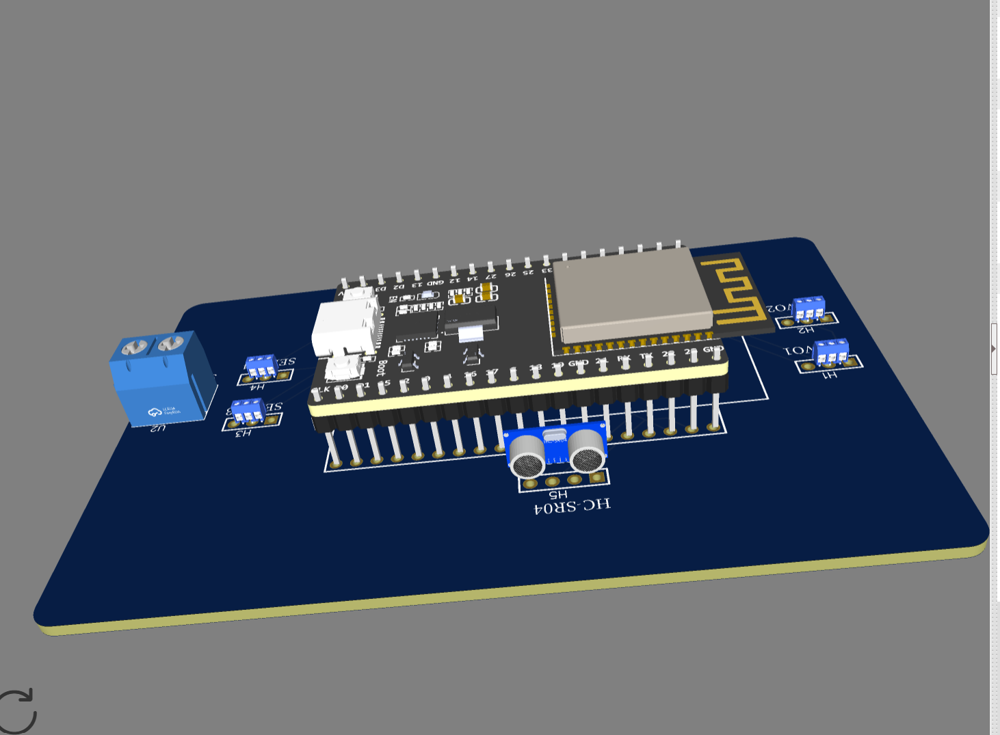

# ESP32 Robot Dog Control PCB

## 🎥 3D Preview

https://github.com/user-attachments/assets/29ea81dd-3031-4a29-84f7-5c1e416f6700

---

## Project Overview

This project presents a custom double-layer PCB designed for an ESP32-based robot dog.

The board integrates the main controller, four servo motor connections, an HC-SR04 ultrasonic sensor, and an external 5V power input in one organized PCB design.

The layout was created in EasyEDA with a component arrangement inspired by the physical structure of the robot dog.

---

## Main Components

- ESP32 Development Board
- HC-SR04 Ultrasonic Sensor
- 4 × Servo Motor Connectors
- 5V External Power Input
- Double-Layer PCB

---

## Robot Dog Layout

The four servo connections represent the four legs of the robot dog:

- **SERVO1** — Front Left Leg
- **SERVO2** — Rear Left Leg
- **SERVO3** — Front Right Leg
- **SERVO4** — Rear Right Leg

The **HC-SR04 ultrasonic sensor** is positioned at the front of the board to represent the sensing direction of the robot.

The **ESP32** is located at the center as the main controller, while the **5V input** provides external power to the system.

---

## PCB Design Features

- Double-layer PCB
- Rounded board corners
- Organized component placement
- Top and bottom copper routing
- Four dedicated servo connections
- Dedicated ultrasonic sensor connection
- External 5V power input
- Realistic 3D component models
- EasyEDA 3D visualization

---

## Design Process

1. Created the electrical schematic.
2. Converted the schematic into a PCB layout.
3. Arranged the components according to the robot dog structure.
4. Designed a rounded PCB outline.
5. Routed the electrical connections using both PCB layers.
6. Added 3D models for the main components.
7. Verified the final layout using EasyEDA 3D View.

---

## 3D Visualization

The final 3D model provides a realistic preview of the PCB before manufacturing.

The visualization includes:

- ESP32 development board
- HC-SR04 ultrasonic sensor
- Servo connection terminals
- 5V power terminal
- Custom PCB structure

---

## Repository Files

- EasyEDA PCB design file
- EasyEDA schematic file
- Final PCB 3D image
- 3D demonstration video
- Project documentation

---

## Tools Used

- EasyEDA
- ESP32
- HC-SR04
- PCB Routing Tools
- EasyEDA 3D Viewer

---

## Final Result

The final result is a custom ESP32 control PCB designed specifically for a four-servo robot dog system.

The project combines organized motor connections, ultrasonic sensing, external power, double-layer PCB design, and realistic 3D visualization in one complete robotic control board.

---

**Smart Methods — Robotics Engineering Training**

https://github.com/user-attachments/assets/075b81a2-f3e4-4756-9af1-979f00e6e9cc

